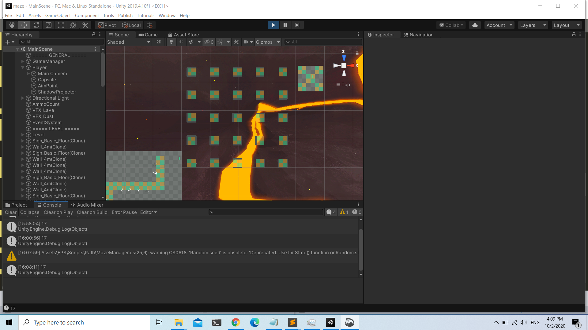

# Maze Game

### Game Design
The main, static play area generally consists of a large rectangular area, styled as an outdoor terrain. The overall area is divided into two, disjoint areas due to a deep canyon, which the player should not be able to get out of if they fall into.
The player should be spawned at one end of the area. From that point, there should be a visually obvious and traversable wandering path, leading to the middle of the canyon edge. This path should be a single, non-intersecting path (unicursal), randomly generated at the start of each playthrough, so it is (probably) different each time. 
Placed at random, distinct locations along the path, are 8 or more visually apparent objects that represent projectile resources. Each time the player passes over such an object it is removed from the level representation, and the player acquires a projectile resource.
The canyon is crossed by traversing a perfect maze, randomized and dynamically constructed to be different on each playthrough. This maze should be based on a 5x5 discrete grid, with all areas reachable, spanning the canyon and ensuring entrance and exit on opposite sides of the canyon. The maze itself is represented by separate floating platforms for each grid cell.
Once the player reaches the other side of the canyon, they need to destroy the maze solution using their projectiles.

### Screenshot
